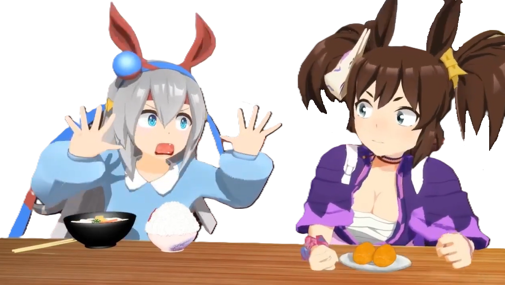

\## Hi there 👋

<!--

\*\*Tyreans/Tyreans\*\* is a ✨ \_special\_ ✨ repository because its `README.md` (this file) appears on your GitHub profile.

Here are some ideas to get you started:

\- 🔭 I’m currently working on ...

\- 🌱 I’m currently learning ...

\- 👯 I’m looking to collaborate on ...

\- 🤔 I’m looking for help with ...

\- 💬 Ask me about ...

\- 📫 How to reach me: ...

\- 😄 Pronouns: ...

\- ⚡ Fun fact: ...

\-->

<!-- !\[Screenshot of a comment on a GitHub issue showing an image, added in the Markdown, of an Octocat smiling and raising a tentacle.](panel\_neuro\_sama\_vedal.png)

<h1 align="center">🐢 I'm <a href="https://vedal.xyz" target="\_blank">Vedal</a>, creator of <a href="https://en.wikipedia.org/wiki/Neuro-sama" target="\_blank">Neuro-sama</a> the AI VTuber on <a href="https://www.twitch.tv/vedal987" target="\_blank">Twitch</a>. 🐢</h1> -->

